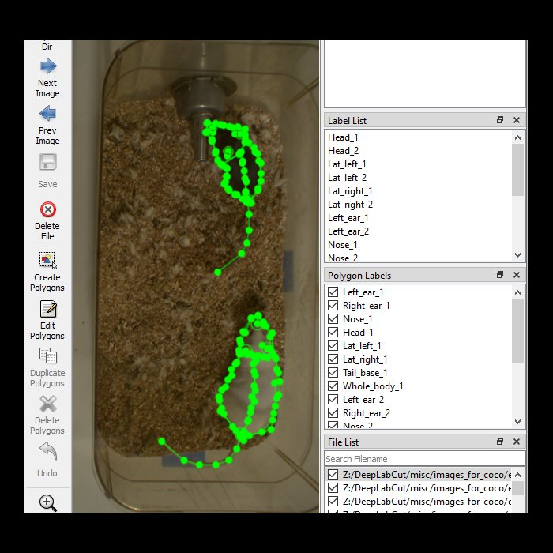

#### Pipeline for detecting and analyzing body parts of black and white mice using [mask RCNN](https://github.com/matterport/Mask_RCNN) and [inception coco](https://github.com/tensorflow/models/blob/master/research/object_detection/g3doc/detection_model_zoo.md). Can be used for 'fingerprinting' animals and individual identification. 

* Weights for mouse resident intruder can be downloaded on [OSF](https://osf.io/6hpdf/). 
* Uses a modified version of [labelme2coco](https://github.com/wkentaro/labelme/blob/master/examples/instance_segmentation/labelme2coco.py) to create coco.json formats from [labelme](https://github.com/wkentaro/labelme) output.
* Uses a modified version of [create_coco_tf_record.py](https://github.com/tensorflow/models/blob/master/research/object_detection/dataset_tools/create_coco_tf_record.py) to create tf records from coco.json format.
* Example renderings on youtube: [[1]](https://www.youtube.com/watch?v=Q_vL_WA1RY0&t=9s), [[2]](https://youtu.be/ay9jaRazpZc), [[3]](https://youtu.be/aarIfZM6sHU).
* Weights were created by labelling images using [labelme](https://github.com/wkentaro/labelme) and labelling 9 body-parts on each mouse.

 

 

   

 
 

  
